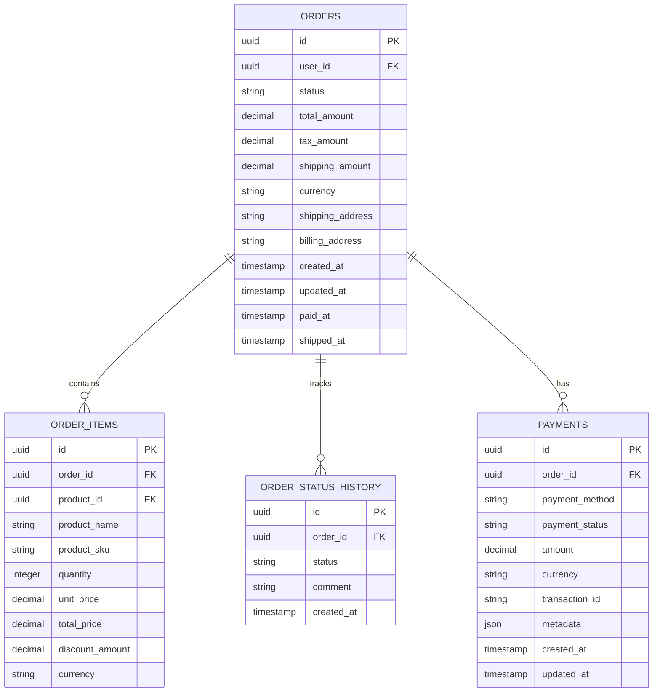

# Orders Service Database Schema Design

## Entity Relationship Diagram



## Database Schema (MongoDB)

### Orders Collection
```javascript
{
  _id: ObjectId,
  uuid: String, // UUID for public identification
  userId: String, // UUID from Auth Service
  status: String, // 'CREADO', 'PAGADO', 'ENVIADO'
  totalAmount: Number,
  taxAmount: Number,
  shippingAmount: Number,
  currency: String, // ISO 4217 currency code
  shippingAddress: {
    street: String,
    city: String,
    state: String,
    postalCode: String,
    country: String
  },
  billingAddress: {
    street: String,
    city: String,
    state: String,
    postalCode: String,
    country: String
  },
  createdAt: Date,
  updatedAt: Date,
  paidAt: Date,
  shippedAt: Date,
  version: Number // For optimistic locking
}
```

### OrderItems Collection
```javascript
{
  _id: ObjectId,
  orderId: String, // UUID referencing Orders collection
  productId: String, // UUID from Products Service
  productName: String, // Denormalized for performance
  productSku: String, // Denormalized for performance
  quantity: Number,
  unitPrice: Number,
  totalPrice: Number,
  discountAmount: Number,
  currency: String,
  createdAt: Date,
  updatedAt: Date
}
```

### OrderStatusHistory Collection
```javascript
{
  _id: ObjectId,
  orderId: String, // UUID referencing Orders collection
  status: String,
  comment: String,
  createdAt: Date,
  createdBy: String // System or user ID
}
```

### Payments Collection
```javascript
{
  _id: ObjectId,
  orderId: String, // UUID referencing Orders collection
  paymentMethod: String, // 'credit_card', 'paypal', 'bank_transfer'
  paymentStatus: String, // 'pending', 'completed', 'failed', 'refunded'
  amount: Number,
  currency: String,
  transactionId: String,
  metadata: Object, // Payment gateway specific data
  createdAt: Date,
  updatedAt: Date
}
```

## Node.js Express Implementation

### Models/Order.js
```javascript
const mongoose = require('mongoose');

const addressSchema = new mongoose.Schema({
  street: { type: String, required: true },
  city: { type: String, required: true },
  state: { type: String, required: true },
  postalCode: { type: String, required: true },
  country: { type: String, required: true }
}, { _id: false });

const orderSchema = new mongoose.Schema({
  uuid: { type: String, required: true, unique: true },
  userId: { type: String, required: true, index: true },
  status: { 
    type: String, 
    enum: ['CREADO', 'PAGADO', 'ENVIADO'],
    default: 'CREADO',
    index: true
  },
  totalAmount: { type: Number, required: true, min: 0 },
  taxAmount: { type: Number, required: true, min: 0 },
  shippingAmount: { type: Number, required: true, min: 0 },
  currency: { type: String, required: true, default: 'USD' },
  shippingAddress: { type: addressSchema, required: true },
  billingAddress: { type: addressSchema, required: true },
  paidAt: { type: Date },
  shippedAt: { type: Date },
  version: { type: Number, default: 0 }
}, {
  timestamps: true
});

orderSchema.index({ userId: 1, createdAt: -1 });
orderSchema.index({ status: 1, createdAt: -1 });

module.exports = mongoose.model('Order', orderSchema);
```

### Models/OrderItem.js
```javascript
const mongoose = require('mongoose');

const orderItemSchema = new mongoose.Schema({
  orderId: { type: String, required: true, index: true },
  productId: { type: String, required: true, index: true },
  productName: { type: String, required: true },
  productSku: { type: String, required: true },
  quantity: { type: Number, required: true, min: 1 },
  unitPrice: { type: Number, required: true, min: 0 },
  totalPrice: { type: Number, required: true, min: 0 },
  discountAmount: { type: Number, default: 0, min: 0 },
  currency: { type: String, required: true }
}, {
  timestamps: true
});

orderItemSchema.index({ orderId: 1, productId: 1 });

module.exports = mongoose.model('OrderItem', orderItemSchema);
```

## Database Migration Considerations

### Migration Strategy
1. **Versioned Migrations**: Use `migrate-mongo` package
2. **Backward Compatibility**: Support multiple schema versions
3. **Data Validation**: Validate existing data on schema changes
4. **Rollback Plan**: Downgrade scripts for each migration

### Example Migration
```javascript
// migrations/001-create-orders-collection.js
module.exports = {
  async up(db, client) {
    await db.createCollection('orders', {
      validator: {
        $jsonSchema: {
          bsonType: 'object',
          required: ['uuid', 'userId', 'status', 'totalAmount'],
          properties: {
            status: {
              enum: ['CREADO', 'PAGADO', 'ENVIADO']
            }
          }
        }
      }
    });

    await db.collection('orders').createIndex({ uuid: 1 }, { unique: true });
    await db.collection('orders').createIndex({ userId: 1, createdAt: -1 });
  },

  async down(db, client) {
    await db.collection('orders').drop();
  }
};
```

## Data Consistency Patterns

### 1. Event-Driven Architecture
```javascript
// Event Publisher
class OrderEventPublisher {
  async publishOrderCreated(order) {
    await eventBus.publish('order.created', {
      orderId: order.uuid,
      userId: order.userId,
      items: order.items,
      totalAmount: order.totalAmount
    });
  }

  async publishOrderPaid(order) {
    await eventBus.publish('order.paid', {
      orderId: order.uuid,
      userId: order.userId,
      amount: order.totalAmount
    });
  }
}
```

### 2. Saga Pattern for Distributed Transactions
```javascript
// Order Processing Saga
class OrderSaga {
  async processOrder(orderData) {
    const transaction = new SagaTransaction();
    
    try {
      // Step 1: Create order
      const order = await this.createOrder(orderData);
      transaction.addCompensation(() => this.cancelOrder(order.uuid));
      
      // Step 2: Reserve inventory
      await this.reserveInventory(order.items);
      transaction.addCompensation(() => this.releaseInventory(order.items));
      
      // Step 3: Process payment
      await this.processPayment(order);
      transaction.addCompensation(() => this.refundPayment(order.uuid));
      
      // Step 4: Confirm order
      await this.confirmOrder(order.uuid);
      
      return order;
    } catch (error) {
      await transaction.compensate();
      throw error;
    }
  }
}
```

### 3. Outbox Pattern
```javascript
// Outbox for reliable event delivery
const outboxSchema = new mongoose.Schema({
  eventType: String,
  eventData: Object,
  processed: { type: Boolean, default: false },
  createdAt: { type: Date, default: Date.now },
  processedAt: Date
});

// Service to process outbox events
class OutboxProcessor {
  async processUnsentEvents() {
    const events = await Outbox.find({ processed: false }).limit(100);
    
    for (const event of events) {
      try {
        await eventBus.publish(event.eventType, event.eventData);
        await Outbox.updateOne(
          { _id: event._id },
          { processed: true, processedAt: new Date() }
        );
      } catch (error) {
        console.error(`Failed to publish event ${event._id}:`, error);
      }
    }
  }
}
```

## API Integration Patterns

### 1. Service Client Pattern
```javascript
// services/AuthServiceClient.js
class AuthServiceClient {
  constructor() {
    this.baseURL = process.env.AUTH_SERVICE_URL;
  }

  async getUser(userId) {
    const response = await axios.get(`${this.baseURL}/api/users/${userId}`);
    return response.data;
  }

  async validateUser(userId) {
    try {
      await this.getUser(userId);
      return true;
    } catch (error) {
      return false;
    }
  }
}

// services/ProductsServiceClient.js
class ProductsServiceClient {
  constructor() {
    this.baseURL = process.env.PRODUCTS_SERVICE_URL;
  }

  async getProduct(productId) {
    const response = await axios.get(`${this.baseURL}/api/products/${productId}`);
    return response.data;
  }

  async getProducts(productIds) {
    const response = await axios.post(`${this.baseURL}/api/products/batch`, {
      ids: productIds
    });
    return response.data;
  }
}

// services/InventoryServiceClient.js
class InventoryServiceClient {
  constructor() {
    this.baseURL = process.env.INVENTORY_SERVICE_URL;
  }

  async reserveStock(items) {
    const response = await axios.post(`${this.baseURL}/api/inventory/reserve`, {
      items: items.map(item => ({
        productId: item.productId,
        quantity: item.quantity
      }))
    });
    return response.data;
  }

  async releaseStock(reservationId) {
    await axios.delete(`${this.baseURL}/api/inventory/reserve/${reservationId}`);
  }
}
```

### 2. Circuit Breaker Pattern
```javascript
// utils/CircuitBreaker.js
class CircuitBreaker {
  constructor(service, options = {}) {
    this.service = service;
    this.failureThreshold = options.failureThreshold || 5;
    this.timeout = options.timeout || 60000;
    this.resetTimeout = options.resetTimeout || 30000;
    
    this.failureCount = 0;
    this.state = 'CLOSED'; // CLOSED, OPEN, HALF_OPEN
    this.nextAttempt = Date.now();
  }

  async call(...args) {
    if (this.state === 'OPEN') {
      if (Date.now() < this.nextAttempt) {
        throw new Error('Circuit breaker is OPEN');
      }
      this.state = 'HALF_OPEN';
    }

    try {
      const result = await this.service.call(...args);
      this.onSuccess();
      return result;
    } catch (error) {
      this.onFailure();
      throw error;
    }
  }

  onSuccess() {
    this.failureCount = 0;
    this.state = 'CLOSED';
  }

  onFailure() {
    this.failureCount++;
    if (this.failureCount >= this.failureThreshold) {
      this.state = 'OPEN';
      this.nextAttempt = Date.now() + this.resetTimeout;
    }
  }
}
```

### 3. Caching Strategy
```javascript
// services/CacheService.js
class CacheService {
  constructor(redisClient) {
    this.redis = redisClient;
    this.defaultTTL = 300; // 5 minutes
  }

  async getUser(userId) {
    const cacheKey = `user:${userId}`;
    let user = await this.redis.get(cacheKey);
    
    if (!user) {
      user = await authServiceClient.getUser(userId);
      await this.redis.setex(cacheKey, this.defaultTTL, JSON.stringify(user));
    } else {
      user = JSON.parse(user);
    }
    
    return user;
  }

  async invalidateUser(userId) {
    await this.redis.del(`user:${userId}`);
  }

  async getProduct(productId) {
    const cacheKey = `product:${productId}`;
    let product = await this.redis.get(cacheKey);
    
    if (!product) {
      product = await productsServiceClient.getProduct(productId);
      await this.redis.setex(cacheKey, this.defaultTTL, JSON.stringify(product));
    } else {
      product = JSON.parse(product);
    }
    
    return product;
  }
}
```

## API Endpoints Design

### Order Controller
```javascript
// controllers/orderController.js
class OrderController {
  async createOrder(req, res) {
    const { items, shippingAddress, billingAddress } = req.body;
    const userId = req.user.id;

    // Validate user exists
    const user = await authServiceClient.getUser(userId);
    
    // Validate products and get current prices
    const productIds = items.map(item => item.productId);
    const products = await productsServiceClient.getProducts(productIds);
    
    // Reserve inventory
    const reservation = await inventoryServiceClient.reserveStock(items);
    
    // Calculate totals
    const totals = this.calculateTotals(items, products);
    
    // Create order
    const order = await Order.create({
      uuid: uuidv4(),
      userId,
      ...totals,
      shippingAddress,
      billingAddress
    });

    // Create order items
    const orderItems = items.map(item => ({
      orderId: order.uuid,
      productId: item.productId,
      productName: products.find(p => p.id === item.productId).name,
      productSku: products.find(p => p.id === item.productId).sku,
      quantity: item.quantity,
      unitPrice: products.find(p => p.id === item.productId).price,
      totalPrice: item.quantity * products.find(p => p.id === item.productId).price,
      currency: 'USD'
    }));

    await OrderItem.insertMany(orderItems);

    // Publish event
    await orderEventPublisher.publishOrderCreated(order);

    res.status(201).json(order);
  }

  async getOrder(req, res) {
    const { orderId } = req.params;
    const userId = req.user.id;

    const order = await Order.findOne({ uuid: orderId, userId });
    if (!order) {
      return res.status(404).json({ error: 'Order not found' });
    }

    const items = await OrderItem.find({ orderId: order.uuid });
    
    res.json({
      ...order.toObject(),
      items
    });
  }

  async updateOrderStatus(req, res) {
    const { orderId } = req.params;
    const { status } = req.body;

    const order = await Order.findOneAndUpdate(
      { uuid: orderId },
      { 
        status,
        updatedAt: new Date(),
        ...(status === 'PAGADO' && { paidAt: new Date() }),
        ...(status === 'ENVIADO' && { shippedAt: new Date() })
      },
      { new: true }
    );

    // Track status history
    await OrderStatusHistory.create({
      orderId: order.uuid,
      status,
      comment: `Status updated to ${status}`,
      createdBy: req.user.id
    });

    // Publish status change event
    await orderEventPublisher.publishOrderStatusChanged(order, status);

    res.json(order);
  }
}
```

## Deployment Considerations

### Docker Configuration
```dockerfile
# Dockerfile
FROM node:18-alpine

WORKDIR /app

COPY package*.json ./
RUN npm ci --only=production

COPY . .

EXPOSE 3000

CMD ["npm", "start"]
```

### Environment Variables
```env
# Database
MONGODB_URI=mongodb://localhost:27017/orders_service
REDIS_URL=redis://localhost:6379

# Service URLs
AUTH_SERVICE_URL=http://localhost:8000
PRODUCTS_SERVICE_URL=http://localhost:9000
INVENTORY_SERVICE_URL=http://localhost:7000

# Event Bus
RABBITMQ_URL=amqp://localhost:5672

# Application
NODE_ENV=production
PORT=3000
JWT_SECRET=your-secret-key
```

This schema design provides a robust foundation for the Orders microservice with proper integration patterns, data consistency mechanisms, and scalability considerations for your polyglot architecture.